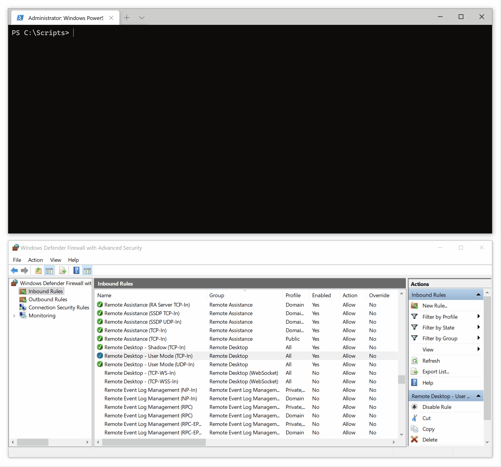

# GeoWF
GeoWF (**Geo**IP **W**indows **F**irewall) is a PowerShell script which can modify accepted remote address ranges on inbound Windows Firewall rules using MaxMind's GeoIP (GeoLite2) databases, allowing Windows Firewall to function as a poor man's firewall with geoblocking.

## Demonstration

*This demo is running with `-InformationAction Continue` in order to show more verbose output.*

## Usage
> :warning: Windows Firewall has a limitation of 10,000 remote IP ranges per rule.

PowerShell must be running elevated to make changes to Windows Firewall.

On your first run, you'll need to [sign up](https://www.maxmind.com/en/geolite2/signup) for a free MaxMind account and set your license key:

```
.\GeoWF.ps1 -MaxMindLicenseKey abcdefgh12345678
```

You can list all countries and their corresponding two letter ISO country codes:

```
.\GeoWF.ps1 -ListCountries
```

By default, *local subnet* is included on firewall rules. This can be turned off by specifying the `-ExcludeLocalSubnet` switch.

### Example 1
Limit all rules in the *Remote Desktop* group to Australia and New Zealand:

```
.\GeoWF.ps1 -RuleDisplayGroup "Remote Desktop" -Country AU,NZ
```

### Example 2
The following command could be used as a scheduled task to periodically update GeoIP databases and limit *VNC Server* and ping replies to Sweden:

```
.\GeoWF.ps1 -ForceDownload -RuleDisplayName "VNC Server","File and Printer Sharing (Echo Request - ICMPv4-In)" -Country SE
```

## Caveats
* Windows Firewall limits IP ranges to 10,000 per rule. I wish I knew this before creating this script. I may add a workaround (such as splitting rules) in the future.
* `-RuleName` is not to be confused with `-RuleDisplayName`. The former is either a shorthand name or GUID and the latter is how rule names appear in `wf.msc`.
* Multiple rules can share the same display name.
